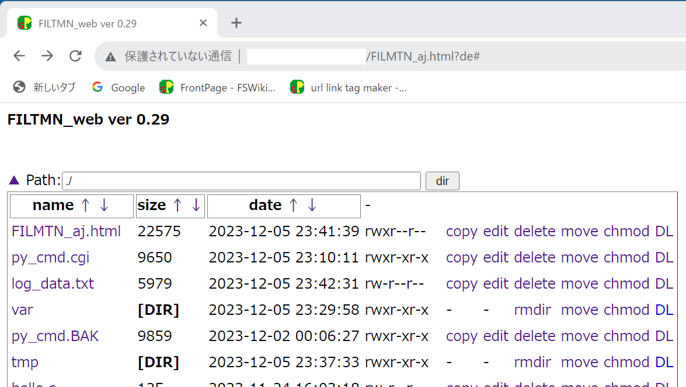

# FILMTN_for_web
File maintenance program via browser

## NOTICE
 - This program is still buggy, caution to unexpected file deleting.
 
## environment for run this program
 - http server that can run python *.cgi script.

## install
 - place the files: FILMTN_aj.html, py_cmd.cgi, filmtn,css on your managing server.
 - about the py_cmd.cgi, set proper permittion, correct shebang line to call python.
 - from browser, access to http://<your_placed_url>/FILMTN_aj.html

(screen example)

 2023-12-1 ver 0.27
